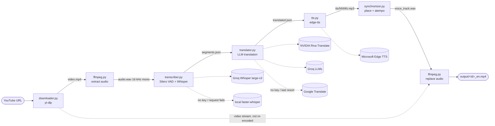

# DubFlow AI

Turns a YouTube video in any language into an English-dubbed video.

```
URL → download (yt-dlp) → extract audio (ffmpeg) → transcribe (Whisper large-v3 on Groq, local fallback)
    → translate (NVIDIA Riva Translate or Groq LLM, Google fallback) → synthesize (edge-tts)
    → sync to original timestamps → replace audio (ffmpeg, video not re-encoded)
```

- **Transcription:** Whisper large-v3 on Groq with a `GROQ_API_KEY`, otherwise locally with `faster-whisper`.
- **Translation:** NVIDIA Riva Translate with an `NVIDIA_API_KEY`, otherwise a Groq LLM with a `GROQ_API_KEY`,
  otherwise Google Translate.
- **Text-to-speech:** an online service (Microsoft Edge TTS).

---

## Setup

```bash
brew install ffmpeg python@3.12
python3.12 -m venv .venv && source .venv/bin/activate
pip install -r requirements.txt
```

Optional: install Node.js (`brew install node`). yt-dlp needs a JavaScript runtime to
unlock some YouTube formats; it uses Deno or Node, whichever is installed.

### API keys (optional, recommended)

Create a `.env` file in the project root (it is ignored by git):

```
GROQ_API_KEY=your_groq_key         # transcription (and translation if no NVIDIA key)
NVIDIA_API_KEY=your_nvidia_key     # translation; get one at build.nvidia.com
```

| Keys set | Transcription | Translation |
|----------|---------------|-------------|
| both (recommended for long videos) | Groq Whisper large-v3 | NVIDIA Riva Translate |
| `GROQ_API_KEY` only | Groq Whisper large-v3 | Groq `gpt-oss` LLM |
| `NVIDIA_API_KEY` only | local `faster-whisper` | NVIDIA Riva Translate |
| none | local `faster-whisper` | Google Translate |

Without `GROQ_API_KEY`, transcription runs locally (much slower on a Mac) and gives noticeably
worse results, especially for Hindi.

**Which translator to use:** Groq's free tier has a daily token limit that runs out after about
an hour of video, and its per-minute limit makes translation slow (~10 min for 45 min of video).
NVIDIA has no daily limit and translated a 2-hour video (~1,250 lines) in about 7 minutes.
The Groq LLM sees neighbouring lines and keeps each line within a word limit, so it can phrase
lines more consistently and fit the timing better. Riva translates each line on its own.

## Run

```bash
python main.py "https://www.youtube.com/watch?v=..."
# or run without a URL and paste it when prompted
python main.py
```

Output: `output/<video_id>_en.mp4`.

---

## Architecture



### Layers

| Layer | Files | Role |
|-------|-------|------|
| Entry point | `main.py` | Loads `.env`, reads the URL, calls `pipeline.run()` |
| Orchestration | `app/pipeline.py` | Runs the 7 steps in order; `stage()` skips a step whose output file exists, so runs can resume |
| Steps | `downloader.py`, `transcriber.py`, `translator.py`, `tts.py`, `synchronizer.py` | One module per step; each reads the previous step's file and writes its own |
| Shared helpers | `app/ffmpeg.py`, `app/models.py` | ffmpeg/ffprobe wrappers; the `Segment` dataclass and JSON save/load |
| Configuration | `app/settings.py` | Models, timing limits, voices, concurrency |

### Data model

Every step after transcription passes around a list of `Segment`s (`app/models.py`):

```python
Segment(id, start, end, source_text, translated_text="", speaker="SPEAKER_0")
```

`start`/`end` are the original timestamps; they are what the synchronizer uses to place each English clip.
`speaker` is always `SPEAKER_0` for now. It exists so multi-speaker dubbing can be added later without
changing the data format.

### Services and fallbacks

| Step | Preferred | Fallback |
|------|-----------|----------|
| Transcribe | Groq `whisper-large-v3` (`GROQ_API_KEY`) | Local `faster-whisper` `large-v3-turbo` |
| Translate | NVIDIA `riva-translate-4b-instruct-v2` (`NVIDIA_API_KEY`), else Groq `GROQ_MODELS` (`GROQ_API_KEY`) | Google Translate, per line |
| Speech | Microsoft Edge TTS | none |

### Key design decisions

- **Files as the interface between steps.** Each step writes to `temp/<video_id>/`, which gives resume after
  a crash, easy debugging (inspect or edit `translated.json` by hand), and re-running a single step.
- **LLM translation, not plain machine translation.** The input is noisy speech-recognition text that can mix
  languages. The LLM gets batches with context and a per-line `max_words` limit so the English fits the timing.
- **Place clips by timestamp.** Each clip starts at its segment's original `start`, so timing errors
  don't accumulate over a long video.
- **Time-stretch, capped.** A clip that is too long first uses the silence before the next line, then is
  sped up with `atempo` (pitch unchanged), never beyond `MAX_SPEEDUP` = 1.3×.
- **Video is copied, not re-encoded.** Only the audio track is replaced, which is fast and lossless.
- **Deferred: multiple speakers and voice cloning.** Both need extra models (diarization, a cloning TTS),
  adding cost, latency and failure points. The `speaker` field is the hook for adding them.

---

## How it works

`app/pipeline.py` runs seven steps. Each one writes a file to `temp/<video_id>/`.
If that file already exists, the step is skipped and marked `(cached)`, so an interrupted
run resumes where it stopped when you rerun the same URL. Translation, the longest step, also
saves its progress to `translated.partial.json` as it goes, so even a half-finished translation resumes.

| # | Step | Code | Output |
|---|------|------|--------|
| 1 | Download video | `app/downloader.py` | `video.mp4` |
| 2 | Extract audio (mono, 16 kHz) | `app/ffmpeg.py` | `audio.wav` |
| 3 | Transcribe | `app/transcriber.py` | `segments.json`, `language.txt` |
| 4 | Translate to English | `app/translator.py` | `translated.json` |
| 5 | Synthesize speech | `app/tts.py` | `tts/0000.mp3`, `tts/0001.mp3`, … |
| 6 | Sync voice to timing | `app/synchronizer.py` | `voice_track.wav` |
| 7 | Replace audio track | `app/ffmpeg.py` | `output/<video_id>_en.mp4` |

### 1. Download (`app/downloader.py`)

- Prefers H.264 (`avc1`) video with M4A audio, merged into MP4, so the result plays everywhere.
- Tolerates slow connections: 60 s socket timeout, 10 retries, and 10 retries per fragment.

### 2. Extract audio

ffmpeg converts the audio to mono 16 kHz WAV, the format Whisper expects.

### 3. Transcribe (`app/transcriber.py`)

- Silero VAD (bundled with `faster-whisper`) finds where people speak. The audio is cut into
  chunks of about `CHUNK_SECONDS`, always in the middle of a pause, so no word is split.
- Each chunk goes to `GROQ_WHISPER_MODEL` (Whisper large-v3) with word timestamps, uploaded as
  64 kbps MP3. Without a key, or if a request fails, the chunk is transcribed locally
  with `WHISPER_MODEL`.
- Whisper output is cleaned up:
  - Segments Whisper itself marks as probably not speech are dropped (hallucinations over silence or music).
  - A word's end time is capped at `MAX_WORD_SECONDS`. Whisper often stretches the last word
    before a pause across the whole pause.
  - Whisper sometimes skips a stretch of speech. Any gap of `MIN_GAP_SECONDS` or more with no words, where
    the VAD heard speech, is sent for transcription again on its own.
- Words are regrouped into dub lines of `MIN_LINE_SECONDS`–`MAX_LINE_SECONDS`, ending at a pause
  or punctuation where possible. Whisper's own segments can be 30 s long, far too coarse to time a dub.
- The most common language across chunks is saved to `language.txt`.
- Each segment (`app/models.py`) stores `id`, `start`, `end`, `source_text`, `translated_text` and `speaker`.

Why not the local `small` model: on Hindi/Hinglish it produced mostly gibberish and dropped
about 75% of the speech, and the translator then invented plausible English with no relation
to the video.

### 4. Translate (`app/translator.py`)

- **English audio:** the original text is kept and no translation happens.
- **Checkpointing:** progress is written to `translated.partial.json` (every 20 lines with NVIDIA,
  every batch with Groq). A rerun loads it and translates only the missing lines. The file is
  deleted once `translated.json` is written.

#### With `NVIDIA_API_KEY`: Riva Translate (used first when set)

- Model: `NVIDIA_MODEL` (`nvidia/riva-translate-4b-instruct-v2`), a model built for translation,
  called through NVIDIA's OpenAI-compatible API.
- **One line per request.** Given batches of lines as JSON, Riva dropped a third or more of
  the lines and sometimes returned truncated JSON. Sent one sentence at a time, it is accurate
  and takes under a second per line.
- The system prompt says the input is Hinglish (Hindi mixed with English). The user prompt
  follows NVIDIA's format, `What is the English translation of the sentence: …`, with no
  trailing `?`. With one, replies ended in stray `?` or ", right?".
- Lines with no Devanagari characters are already English and are kept as they are.
  Riva sometimes "translated" these into another language (e.g. Polish).
- `NVIDIA_CONCURRENCY` requests run in parallel. The free API allows about 40 requests per
  minute. When rate-limited (HTTP 429), a line waits 5, 10, 20, 40, 60 s… and retries, up to
  8 attempts, then falls back to Google Translate.
- Limitation: Riva doesn't see neighbouring lines or the `max_words` limit, so some English lines
  are longer than the original. The sync step speeds those up, but only to `MAX_SPEEDUP`.

#### With `GROQ_API_KEY` only: LLM batches

- Lines are sent to the first of `GROQ_MODELS` in batches of `TRANSLATE_BATCH`.
- The prompt says the input is speech-recognition output from one continuous video. It may mix languages
  and contain misheard words, and one sentence may span several lines. The model should translate for
  meaning in natural spoken English, keep technical terms, and never add content.
- Each line gets a `max_words` limit: the time until the next line starts × `WORDS_PER_SECOND`.
  This keeps the English short enough to fit the original timing.
- The previous 5 translated lines are sent as context for consistency.
- The response uses Groq's strict JSON-schema mode (`{"translations": [{"id", "text"}]}`),
  `temperature=0.3`, `reasoning_effort="low"`.
- The model sometimes merges lines and leaves ids out; batches are small for that reason.
  Missing lines are requested again, up to 3 attempts, and only then sent to Google Translate.
- If Groq rejects a reply as invalid JSON (`json_validate_failed`, most common with long replies
  from `gpt-oss-20b`), the batch is split in half and each half is retried, down to single lines.
- When a model's daily token limit is hit (200K tokens on the free tier, about one
  hour of video), the rest of the run uses the next model in `GROQ_MODELS`.
- The Groq client retries up to 6 times on rate limits. On Groq's free tier (8,000 tokens per
  minute) this rate limit is what sets the translation speed, about 10 minutes for a 45-minute video.

#### With neither key: Google Translate

- Each line goes through Google Translate (`deep-translator`).
- The free endpoint allows about 5 requests per second, so there is a 0.25 s delay between
  requests and a backoff of 5, 10, 20, 40 and 80 s when rate-limited.
- If it still fails, the line is left silent instead of reading the untranslated text in an English voice.

### 5. Synthesize speech (`app/tts.py`)

- Uses Microsoft Edge TTS (`edge-tts`) with the voice in `TTS_VOICE`.
- Makes `TTS_CONCURRENCY` requests in parallel.
- Clips that already exist are skipped, so this step also resumes after an interruption.

### 6. Sync to original timing (`app/synchronizer.py`)

- Leading and trailing silence is trimmed from each TTS clip.
- Each English clip is placed at its segment's original start time.
- A clip may use the gap before the next line, not just its own segment.
- If a clip is still too long, ffmpeg's `atempo` speeds it up, but never beyond `MAX_SPEEDUP`
  so speech stays natural. Speed-up changes the tempo without changing the pitch.
- Clips never overlap. If the previous clip is still playing, the next one starts when it ends
  (and speeds up more to catch up). The largest delay behind the original is printed.
- The clips form one mono 16-bit track at `SAMPLE_RATE`.

### 7. Replace audio

ffmpeg copies the original video stream unchanged (`-c:v copy`, fast and lossless) and adds
the new English audio as AAC.

---

## Whisper model details

### Which model is used

Set in `app/settings.py`:

```python
GROQ_WHISPER_MODEL = "whisper-large-v3"  # used when GROQ_API_KEY is set
WHISPER_MODEL = "large-v3-turbo"         # local fallback
```

The local model is loaded only when it is needed (no key, or a Groq request failed):

```python
WhisperModel(settings.WHISPER_MODEL, device="auto", compute_type="int8")
```

### Where the model is downloaded

The project has no download code of its own. On the first run, `faster-whisper` downloads
the model from Hugging Face automatically:

1. `WhisperModel.__init__` (`.venv/lib/python3.12/site-packages/faster_whisper/transcribe.py`)
   checks whether the name is a local folder. If not, it calls `download_model()`.
2. `download_model()` (`faster_whisper/utils.py`) looks up the name in `_MODELS`,
   e.g. `"large-v3-turbo"` → `mobiuslabsgmbh/faster-whisper-large-v3-turbo`.
3. It calls `huggingface_hub.snapshot_download()` and fetches only `config.json`,
   `preprocessor_config.json`, `model.bin`, `tokenizer.json` and `vocabulary.*`.
4. Files are saved to `~/.cache/huggingface/hub/models--Systran--faster-whisper-<size>/`.
   Later runs use this cache and don't download again.

To control this, pass options to `WhisperModel`:

```python
WhisperModel(model_size, ..., download_root="models/")     # save somewhere else
WhisperModel(model_size, ..., local_files_only=True)       # never go online
WhisperModel("/path/to/faster-whisper-small", ...)         # load a local folder
```

### Storage and memory

Measured on this project with `small`: **464 MB on disk**, and the whole `main.py` process
used about **1.2 GB of RAM** during a run. The model itself accounts for roughly 0.5–1 GB;
the rest is Python, the libraries and the audio data.

Approximate figures for other sizes with `int8`:

| Model | Disk | RAM | Notes |
|-------|------|-----|-------|
| tiny | ~75 MB | ~0.3 GB | fastest, least accurate |
| base | ~145 MB | ~0.4 GB | |
| small | ~464 MB | ~0.6–1 GB | poor on Hindi |
| medium | ~1.5 GB | ~1.5–2 GB | |
| **large-v3-turbo** (default) | **~1.6 GB** | **~2 GB** | close to large-v3, much faster |
| large-v3 | ~3 GB | ~3–4 GB | most accurate, much slower on CPU |

`int8` uses about half the memory of full precision, with little loss in accuracy.

On a Mac, `faster-whisper` runs on the **CPU** (CTranslate2 doesn't support Apple GPUs),
so `device="auto"` means CPU. Larger models fit in memory on a 16 GB Mac but take much
longer to transcribe. On a machine with an NVIDIA GPU, `device="auto"` uses CUDA.

To delete a downloaded model:

```bash
rm -rf ~/.cache/huggingface/hub/models--Systran--faster-whisper-small
```

---

## Settings (`app/settings.py`)

| Setting | Default | Meaning |
|---------|---------|---------|
| `GROQ_WHISPER_MODEL` | `"whisper-large-v3"` | Transcription model when `GROQ_API_KEY` is set |
| `WHISPER_MODEL` | `"large-v3-turbo"` | Local Whisper model size (see above) |
| `CHUNK_SECONDS` | `600` | Audio per transcription request (Groq's upload limit is 25 MB) |
| `MIN_LINE_SECONDS` / `MAX_LINE_SECONDS` | `3` / `10` | Length range of a dub line |
| `MAX_WORD_SECONDS` | `1.5` | Cap on a single word's duration from Whisper |
| `MIN_GAP_SECONDS` | `4` | Word-less gap with speech in it that gets transcribed again |
| `TTS_VOICE` | `"en-US-GuyNeural"` | Edge TTS voice; list them with `edge-tts --list-voices` |
| `TTS_CONCURRENCY` | `8` | Parallel TTS requests |
| `MAX_SPEEDUP` | `1.3` | Maximum speed-up for a clip that's too long |
| `SAMPLE_RATE` | `24000` | Sample rate of the dubbed voice track |
| `NVIDIA_MODEL` | `"nvidia/riva-translate-4b-instruct-v2"` | Translation model when `NVIDIA_API_KEY` is set |
| `NVIDIA_CONCURRENCY` | `4` | Parallel NVIDIA translation requests |
| `GROQ_MODELS` | `["openai/gpt-oss-120b", "openai/gpt-oss-20b"]` | Translation LLMs, in order of preference |
| `TRANSLATE_BATCH` | `12` | Segments per Groq LLM request |
| `WORDS_PER_SECOND` | `2.6` | English speaking pace, used for `max_words` |

## Project layout

```
main.py              CLI entry point; loads .env and runs the pipeline
app/
  pipeline.py        the 7 steps, with caching and timing
  downloader.py      yt-dlp download and video ID lookup
  ffmpeg.py          ffmpeg / ffprobe helpers
  transcriber.py     Whisper transcription (Groq or local) and splitting into dub lines
  translator.py      NVIDIA Riva / Groq LLM translation, checkpointing, Google Translate fallback
  tts.py             edge-tts speech synthesis
  synchronizer.py    places and speeds up clips to match timing
  models.py          Segment dataclass and JSON save/load
  settings.py        configuration
temp/<video_id>/     intermediate files (safe to delete)
output/              finished dubbed videos
```

## Troubleshooting

- **Re-do a step:** delete its file in `temp/<video_id>/`, e.g. delete `translated.json`
  (and `translated.partial.json`, if present) to translate again. Also delete the outputs of every later step (`tts/`, `voice_track.wav`
  and the output video), or they will be reused with the old text.
- **Start over completely:** delete `temp/<video_id>/`.
- **`ffmpeg` not found:** run `brew install ffmpeg`.
- **YouTube download fails or formats are missing:** update yt-dlp with
  `pip install -U "yt-dlp[default]"` and make sure Node or Deno is installed.
- **"Google Translate still rate-limited":** add an `NVIDIA_API_KEY` or `GROQ_API_KEY`, or wait and rerun;
  finished steps are cached.
- **"daily token limit reached" on Groq:** add an `NVIDIA_API_KEY` (no daily limit), or wait for
  the limit to reset. Press Ctrl+C at any time; the next run continues from the saved progress.
- **Translation is slow:** with Groq, the per-minute token limit sets the pace; use NVIDIA instead.
  With NVIDIA, frequent 429 retries mean `NVIDIA_CONCURRENCY` is too high for your account.
- **Transcription too slow (no key):** set a `GROQ_API_KEY`, or use a smaller `WHISPER_MODEL`
  (accuracy drops sharply for non-English audio).
- **Dubbed speech sounds rushed or overlaps:** lower `WORDS_PER_SECOND` so translations
  are shorter, or raise `MAX_SPEEDUP` slightly.
